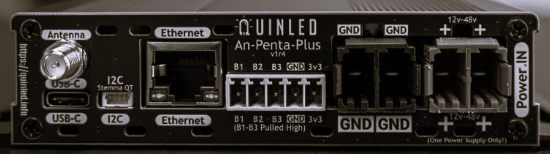

# QuinLED EnIP

<h2 align="center">EtherNet/IP Controller for QuinLED Penta Plus</h2>

<div align="center">



</div>

## Overview

This project represents a proof-of-concept implementation of the [OpENer EtherNet/IP Stack](https://github.com/EIPStackGroup/OpENer) ported to the ESP32 platform. The development of this port serves to demonstrate the feasibility of running industrial EtherNet/IP communication protocols on cost-effective, widely available microcontroller platforms.

This particular implementation was developed to address a specific industrial automation requirement: an RGB stack light controller for a Motoman robotic manufacturing workcell. The system enables direct integration of visual status indicators with the workcell's EtherNet/IP network infrastructure, allowing PLCs and other industrial control systems to programmatically control stack light colors and patterns for operator feedback and system status indication. This implementation allows the Motoman Robot to directly control the stack light through EtherNet/IP implicit messaging, providing real-time visual feedback synchronized with robot operations and workcell status.

The project leverages the **QuinLED Penta Plus** LED controller board as the target hardware platform, providing a robust foundation for LED control with multiple PWM channels and digital LED support. Through this implementation, we validate the OpENer stack's compatibility with ESP32-based systems and demonstrate practical industrial automation applications using open-source EtherNet/IP solutions.

## Project Status

**Proof of Concept**: This project is a demonstration and validation of the OpENer EtherNet/IP stack on ESP32 hardware. It is not intended for production use without further development, testing, and validation.

## Target Hardware

### QuinLED Penta Plus

The QuinLED Penta Plus is an advanced ESP32-based LED controller board designed for professional lighting control applications. This board was selected for its comprehensive LED control capabilities and Ethernet connectivity, making it well-suited for industrial automation applications.

**Hardware Links:**
- **Official Product Page**: [https://quinled.info/quinled-an-penta-plus/](https://quinled.info/quinled-an-penta-plus/)
- **Purchase**: Available through QuinLED's official channels

**Key Features:**
- **Microcontroller**: ESP32-WROOM-32UE (4MB Flash)
- **Ethernet**: LAN8720 PHY with RMII interface
- **LED Channels**: 
  - 5 analog PWM channels (Cool White, Warm White, Red, Green, Blue)
  - 1 digital LED channel (WS2812/SK6812 compatible, supports up to 65,535 LEDs)
- **Inputs**: 3 digital inputs with hardware debounce
- **Display**: SPI OLED display (optional)
- **I2C**: External I2C connector (Stemma QT/Qwiic compatible)

## OpENer EtherNet/IP Stack

This project integrates the [OpENer EtherNet/IP Stack](https://github.com/EIPStackGroup/OpENer), an open-source implementation of the Common Industrial Protocol (CIP) over Ethernet. OpENer provides:

- **EtherNet/IP Explicit Messaging**: For configuration and data exchange
- **EtherNet/IP Implicit Messaging**: For real-time I/O connections
- **CIP Objects**: Identity, TCP/IP Interface, Ethernet Link, Assembly, Connection Manager, QoS
- **NVS Storage**: Persistent storage of network configuration (IP address, hostname, etc.)

## Assembly Data Structure

The device implements two EtherNet/IP assemblies for I/O data exchange. These assemblies define the data structure used for communication between the EtherNet/IP scanner (typically a PLC) and the device.

### Output Assembly (Instance 150) - 11 Bytes

The output assembly is used to send control data from the EtherNet/IP scanner (PLC) to the device. This assembly contains all the parameters necessary to control the LED outputs.

| Byte | Offset | Parameter | Description | Range |
|------|--------|-----------|-------------|-------|
| 0 | `LED_OUTPUT_OFFSET_CW` | Param4 | Cool White LED brightness | 0-255 |
| 1 | `LED_OUTPUT_OFFSET_WW` | Param5 | Warm White LED brightness | 0-255 |
| 2 | `LED_OUTPUT_OFFSET_B` | Param6 | Blue LED brightness | 0-255 |
| 3 | `LED_OUTPUT_OFFSET_G` | Param7 | Green LED brightness | 0-255 |
| 4 | `LED_OUTPUT_OFFSET_R` | Param8 | Red LED brightness | 0-255 |
| 5 | `LED_OUTPUT_OFFSET_DIGITAL_COUNT_LOW` | Param9 | Digital LED count (low byte) | 0-255 |
| 6 | `LED_OUTPUT_OFFSET_DIGITAL_COUNT_HIGH` | Param17 | Digital LED count (high byte) | 0-255 |
| 7 | `LED_OUTPUT_OFFSET_DIGITAL_ENABLE` | Param10 | Digital LED enable (0=off, 1=on) | 0-1 |
| 8 | `LED_OUTPUT_OFFSET_DIGITAL_R` | Param11 | Digital LED red component | 0-255 |
| 9 | `LED_OUTPUT_OFFSET_DIGITAL_G` | Param12 | Digital LED green component | 0-255 |
| 10 | `LED_OUTPUT_OFFSET_DIGITAL_B` | Param13 | Digital LED blue component | 0-255 |

**Implementation Notes:**
- **Bytes 0-4**: Control the 5 analog PWM LED channels (GPIO 33, 32, 12, 4, 2). These channels can be used independently or combined for color mixing.
- **Bytes 5-6**: Form a 16-bit little-endian value for digital LED count (0-65,535 LEDs). This allows control of large addressable LED strips or arrays.
- **Byte 7**: Enables/disables the digital LED output via relay control (GPIO 13). When disabled, the digital LED power is cut.
- **Bytes 8-10**: RGB color values for all digital LEDs (WS2812/SK6812 format, sent via GPIO 5). All LEDs in the strip display the same color.

### Input Assembly (Instance 100) - 14 Bytes

The input assembly is used to send status data from the device back to the EtherNet/IP scanner. This provides feedback and monitoring capabilities.

| Byte | Offset | Parameter | Description | Range |
|------|--------|-----------|-------------|-------|
| 0-10 | - | - | Mirrored from Output Assembly | Same as Output |
| 11 | `INPUT_OFFSET_DIGITAL_INPUTS` | Param14 | Digital Input 1 state (0=low, 1=high) | 0-1 |
| 12 | `INPUT_OFFSET_DIGITAL_INPUTS + 1` | Param15 | Digital Input 2 state (0=low, 1=high) | 0-1 |
| 13 | `INPUT_OFFSET_DIGITAL_INPUTS + 2` | Param16 | Digital Input 3 state (0=low, 1=high) | 0-1 |

**Implementation Notes:**
- **Bytes 0-10**: Mirror the current output assembly values, providing read-back of control values for verification and status monitoring.
- **Bytes 11-13**: Report the state of the 3 digital inputs (GPIO 36, 39, 34). These inputs are active-low with pull-up resistors, so a GPIO low reading indicates an active input (value = 1).

## GPIO Pin Assignments

### Analog PWM LED Channels

The board provides five independent PWM channels for analog LED control, enabling tunable white and RGB color mixing:

| Channel | GPIO | Function | Color/Type |
|---------|------|----------|------------|
| L1 | GPIO 33 | PWM Output | Cool White (CW) - ~5000K-6500K |
| L2 | GPIO 32 | PWM Output | Warm White (WW) - ~2700K-3000K |
| L3 | GPIO 12 | PWM Output | Blue (B) - RGB channel |
| L4 | GPIO 4 | PWM Output | Green (G) - RGB channel |
| L5 | GPIO 2 | PWM Output | Red (R) - RGB channel |

**PWM Configuration:**
- Frequency: 5 kHz (reduces audible noise while maintaining smooth dimming)
- Resolution: 13-bit (0-8191 steps)
- Duty cycle mapping: 0-255 input values mapped to 0-8191 PWM steps

### Digital LED Control

Addressable LED strips (WS2812, SK6812, etc.) are controlled via the RMT peripheral:

| Function | GPIO | Description |
|----------|------|-------------|
| Digital LED Data | GPIO 5 | Level-shifted data pin for addressable LED strips |
| Digital LED Relay | GPIO 13 | Power control relay for digital LED positive output |

**Digital LED Implementation:**
- Uses ESP32 RMT (Remote Control) peripheral for precise timing requirements
- Supports WS2812/SK6812 protocol (800 kHz, GRB color order)
- LED count: 0-65,535 LEDs (16-bit value, little-endian)
- All LEDs in the strip display the same RGB color value simultaneously

### Digital Inputs

Three digital inputs provide status feedback and control signals:

| Input | GPIO | Characteristics |
|-------|------|----------------|
| Digital Input 1 | GPIO 36 | Input-only, active-low (pulled high) |
| Digital Input 2 | GPIO 39 | Input-only, active-low (pulled high) |
| Digital Input 3 | GPIO 34 | Input-only, active-low (pulled high) |

**Note**: GPIO 34, 36, and 39 are input-only pins on ESP32 and cannot be configured as outputs. These pins do not support internal pull-up resistors, so external pull-ups are required (provided by the board hardware).

### Ethernet Configuration

Ethernet connectivity is provided via the LAN8720 PHY:

| Signal | GPIO | Function |
|--------|------|----------|
| ETH MDC | GPIO 23 | Ethernet management clock |
| ETH MDIO | GPIO 18 | Ethernet management data |
| ETH Clock | GPIO 17 | RMII clock output |

**Ethernet PHY**: LAN8720 (address 0)

## EtherNet/IP Connection Types

The device supports three standard EtherNet/IP connection types, providing flexibility for different integration scenarios:

1. **Exclusive Owner** (Connection 1)
   - Bidirectional: Output 11 bytes, Input 14 bytes
   - Full control and status monitoring
   - Configurable RPI (Requested Packet Interval)
   - Recommended for primary control applications

2. **Input Only** (Connection 2)
   - Unidirectional: Input 14 bytes only
   - Status monitoring without control capability
   - Configurable RPI
   - Useful for monitoring-only applications

3. **Listen Only** (Connection 3)
   - Unidirectional: Input 14 bytes only
   - Read-only status monitoring
   - Configurable RPI
   - Suitable for passive monitoring and diagnostics

## Device Identity

The device presents the following identity information to EtherNet/IP scanners:

- **Vendor ID**: 55512 (AGSweeney Automation)
- **Device Type**: 7 (Generic Device)
- **Product Code**: 1
- **Major Revision**: 1
- **Minor Revision**: 1
- **Product Name**: "QuinLEDPentaPlus"
- **Serial Number**: 7792400897

## Network Configuration

The device supports both DHCP and static IP configuration, providing flexibility for different network environments:

- **DHCP**: Automatically obtains IP address, gateway, and DNS from network DHCP server
- **Static IP**: Manually configured IP address, netmask, gateway, and DNS servers
- **Hostname**: Configurable (default: "QuinLED-EnIP")
- **NVS Storage**: Network configuration is saved to NVS flash and persists across reboots

### Web UI

A minimal web interface is provided for network configuration and diagnostics:

- **URL**: `http://<device-ip>/`
- **API Endpoint**: `/api/ipconfig` (GET/POST)
- **Features**: View and configure IP settings (DHCP/Static, IP address, netmask, gateway, DNS)

The web interface provides a simple means to configure network settings without requiring EtherNet/IP tools or serial console access.

## Building and Flashing

### Prerequisites

- **ESP-IDF**: Version 5.5.1 or later
- **Python**: 3.8 or later
- **CMake**: 3.16 or later

### Build Steps

```bash
# Set up ESP-IDF environment
. $HOME/esp/esp-idf/export.sh

# Configure the project
idf.py menuconfig

# Build the project
idf.py build

# Flash to device
idf.py flash

# Monitor serial output
idf.py monitor
```

### Partition Table

The device uses a 4MB flash with the following partition layout:

- **NVS**: 20 KB (0x9000 - 0xE000) - Non-volatile storage for configuration
- **OTA Data**: 8 KB (0xE000 - 0x10000) - OTA update metadata
- **OTA_0**: 1.5 MB (0x10000 - 0x190000) - Primary application partition
- **OTA_1**: 1.5 MB (0x190000 - 0x310000) - Secondary application partition (for OTA updates)
- **SPIFFS**: 960 KB (0x310000 - 0x400000) - File system partition

## EDS File

**⚠️ WARNING: The EDS file is incomplete and should NOT be used for production or device configuration.**

An Electronic Data Sheet (EDS) file is provided for reference only:

- **Location**: `eds/ESP32P4_OPENER.eds`
- **Format**: EZ-EDS v3.38
- **Status**: Incomplete - Do not use

The EDS file is a work in progress and may contain errors or missing information. It should not be used with EtherNet/IP configuration tools until it has been completed and validated.

## Project Structure

```
QuinLED_EnIP/
├── main/                    # Main application code
│   └── main.c              # Ethernet and OpENer initialization
├── components/
│   ├── opener/            # OpENer EtherNet/IP stack
│   │   └── src/ports/ESP32/
│   │       └── quinled_enip_application/  # Application-specific code
│   ├── webui/             # Web interface for network configuration
│   ├── lwip/              # LWIP network stack
│   └── esp_netif/         # ESP-IDF network interface
├── docs/                   # Documentation and images
├── eds/                    # Electronic Data Sheet (incomplete)
└── partitions.csv         # Flash partition table
```

## License

### Original Code

All original code in this project is licensed under the MIT License:

```
Copyright (c) 2025, Adam G. Sweeney <agsweeney@gmail.com>

Permission is hereby granted, free of charge, to any person obtaining a copy
of this software and associated documentation files (the "Software"), to deal
in the Software without restriction, including without limitation the rights
to use, copy, modify, merge, publish, distribute, sublicense, and/or sell
copies of the Software, and to permit persons to whom the Software is
furnished to do so, subject to the following conditions:

The above copyright notice and this permission notice shall be included in
all copies or substantial portions of the Software.

THE SOFTWARE IS PROVIDED "AS IS", WITHOUT WARRANTY OF ANY KIND, EXPRESS OR
IMPLIED, INCLUDING BUT NOT LIMITED TO THE WARRANTIES OF MERCHANTABILITY,
FITNESS FOR A PARTICULAR PURPOSE AND NONINFRINGEMENT. IN NO EVENT SHALL THE
AUTHORS OR COPYRIGHT HOLDERS BE LIABLE FOR ANY CLAIM, DAMAGES OR OTHER
LIABILITY, WHETHER IN AN ACTION OF CONTRACT, TORT OR OTHERWISE, ARISING FROM,
OUT OF OR IN CONNECTION WITH THE SOFTWARE OR THE USE OR OTHER DEALINGS IN
THE SOFTWARE.
```

### Third-Party Components

This project integrates the following third-party components with their respective licenses:

- **OpENer EtherNet/IP Stack**: Licensed under an adapted BSD-style license by Rockwell Automation, Inc. See `components/opener/LICENSE.txt` for full license terms. EtherNet/IP is a trademark of ODVA, Inc.

- **LWIP**: Licensed under a BSD-style license by Swedish Institute of Computer Science. See `components/lwip/lwip/COPYING` for full license terms.

- **ESP-IDF**: Licensed under Apache License 2.0 by Espressif Systems. See ESP-IDF documentation for full license terms.

All third-party licenses are preserved and remain intact. Please refer to the respective component directories for complete license information.

## Acknowledgments

- **OpENer Stack**: [EIPStackGroup/OpENer](https://github.com/EIPStackGroup/OpENer) - Open-source EtherNet/IP stack
- **QuinLED**: [quinled.info](https://quinled.info) - Hardware platform provider
- **ESP-IDF**: Espressif Systems - ESP32 development framework

**Note**: This project is not affiliated with, endorsed by, or connected to QuinLED. QuinLED and QuinLED Penta Plus are trademarks of their respective owners. This project uses the QuinLED Penta Plus board as the target hardware platform for demonstration purposes only.

## Support

For issues, questions, or contributions, please refer to the project repository or contact the maintainer.

---

**Note**: This documentation reflects the current proof-of-concept implementation. For the latest updates and changes, please refer to the project repository.
